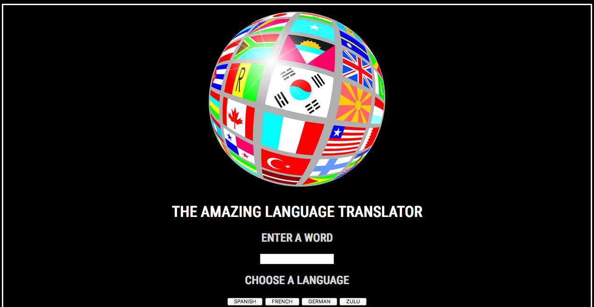

# JS Translator

This is a translator built through a combination of HTML/CSS and JS.  The user will be able to input holiday themed words, click the corresponding buttons to translate to the associate language.  

## Screenshots



## How to run this project
* Use npm to install http-server in your terminal:
```sh 
npm install -g http-server
```
* Run the server
```sh
hs -p 9999
```
* Open Chrome and navigate to:
```
localhost.9999
```

